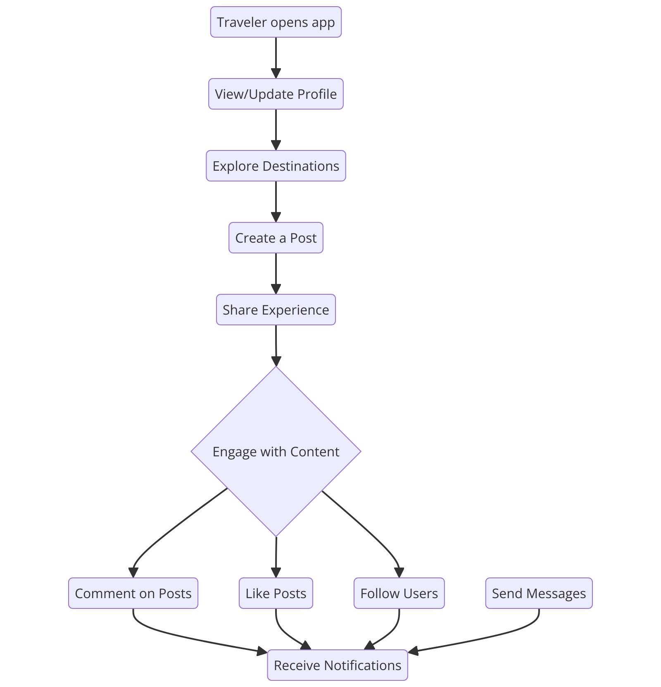
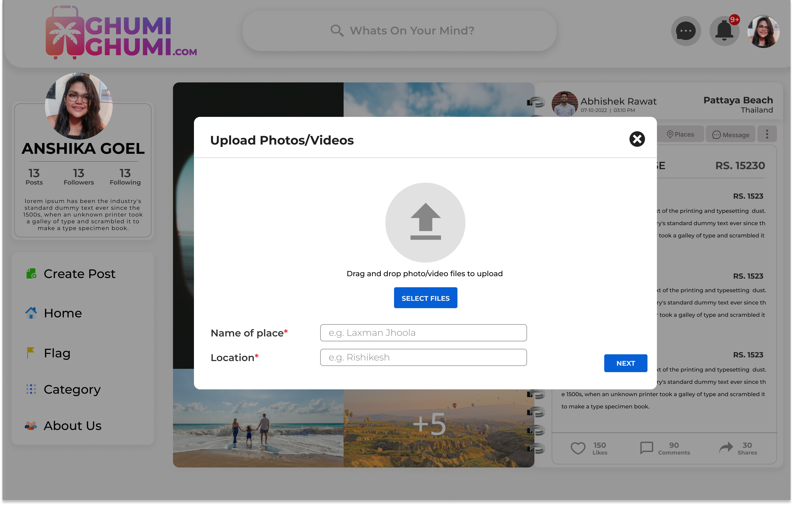

# Travelling Social Media Website

Welcome to the Travelling Social Media Website! This platform allows users to share their travel experiences, photos, and tips with a community of travel enthusiasts.

## Table of Contents
1. [Introduction](#introduction)
2. [Features](#features)
3. [Technologies Used](#technologies-used)
4. [Installation](#installation)
5. [Usage](#usage)
6. [Flowchart](#flowchart)
7. [Screenshots](#screenshots)


## Introduction
This project aims to provide a social media platform specifically for travelers. Users can create profiles, post travel stories, upload photos, and interact with other travelers by liking and commenting on posts.

## Features
- User authentication and profile management
- Post travel stories and photos
- Like and comment on posts
- Follow other users
- Search for travel destinations

## Technologies Used
- Frontend: HTML, CSS, JavaScript, React
- Backend: Node.js, Express.js
- Database: Firebase
- Authentication: JWT (JSON Web Tokens)


## Installation
To get a local copy up and running, follow these simple steps:

 Clone the repository:
   ```sh
   git clone https://github.com/yourusername/travel-social-media.git
  ```

## Usage
Once the server is running, open your browser and navigate to http://localhost:3000 to see the application in action. Sign up, create a profile, and start sharing your travel stories!


## Flowchart
Below is a flowchart of the website architecture:



## Screenshots
Here are some screenshots of the application:

### Landing Page


### Home Page


### Profile Page


### Post Creation

